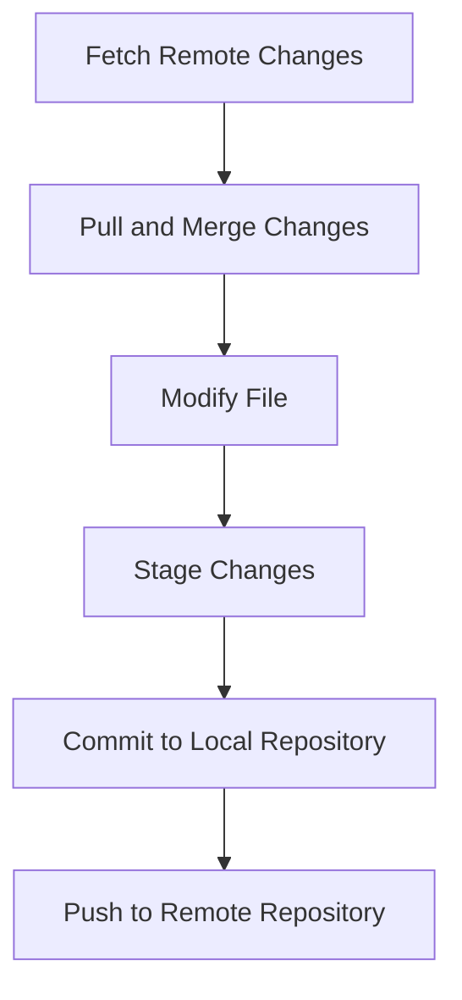

### Git Commands Cheat Sheet for Students

A quick reference guide for the most commonly used Git commands, explanations, examples, and VSCode shortcuts.

---

## 🔑 Essential Git Commands

| **Command**                | **Description**                               | **Example**                                         | **VSCode Shortcut**                     |
| -------------------------- | --------------------------------------------- | --------------------------------------------------- | --------------------------------------- |
| `git init`                 | Initialize a new Git repository               | `git init`                                          | Command Palette: Git Init               |
| `git clone <repo-url>`     | Copy an existing repository to your computer  | `git clone https://github.com/username/project.git` | Command Palette: Git Clone              |
| `git status`               | Check current branch and changes              | `git status`                                        | Source Control panel                    |
| `git add <file>`           | Stage a file for commit                       | `git add main.py`                                   | Source Control panel: + icon            |
| `git add .`                | Stage all changed files                       | `git add .`                                         | Source Control: Stage All               |
| `git commit -m "message"`  | Save changes with a descriptive message       | `git commit -m "Add login feature"`                 | Source Control: Message + Commit        |
| `git push`                 | Upload local commits to GitHub                | `git push`                                          | Command Palette: Git Push               |
| `git pull`                 | Get latest changes from the remote repo       | `git pull`                                          | Command Palette: Git Pull               |
| `git fetch`                | Check for changes on GitHub (without merging) | `git fetch`                                         | Command Palette: Git Fetch              |
| `git merge <branch>`       | Combine changes from another branch           | `git merge feature`                                 | Command Palette: Git Merge              |
| `git branch`               | View all branches                             | `git branch`                                        | Command Palette: Git Branch             |
| `git branch <name>`        | Create a new branch                           | `git branch feature`                                | Command Palette: Git Create Branch      |
| `git checkout <branch>`    | Switch to a different branch                  | `git checkout main`                                 | Command Palette: Git Checkout           |
| `git checkout -b <branch>` | Create and switch to a new branch             | `git checkout -b feature`                           | Command Palette: Git Checkout -b        |
| `git log`                  | Show commit history                           | `git log`                                           | Command Palette: Git Log                |
| `git diff`                 | See differences between files                 | `git diff`                                          | Source Control: Click file to view diff |

---

## 💡 Pro Tips

* **Commit Often:** Save your progress regularly with clear messages.
* **Branch Smartly:** Use branches for new features or experiments.
* **Pull Before You Push:** Always pull the latest changes before pushing.
* **Use PRs on GitHub:** Pull Requests let you review and discuss changes before merging.
* **Ask for Help:** If you're stuck, reach out to your team!

Would you like me to add a printable version or a visual diagram of the Git workflow?

---

## 🖼️ Visual Diagram of Git Workflow

This diagram shows a typical Git workflow cycle.

---
